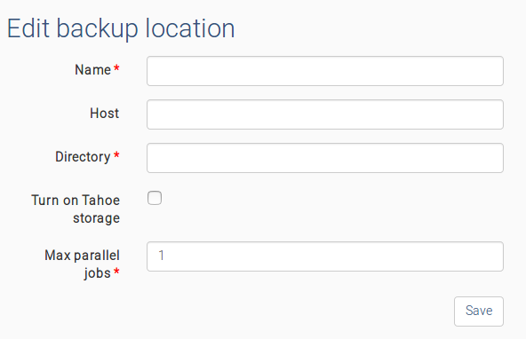

We are copying the data to disk so we have to define which will be the main folder under which each job will save the data. The ElkarBackup application will give you the option to define multiple backup locations in which you will be able to store your data. When defining a job you will be asked to specify the location to store the backup. By default it is the _**/var/spool/elkarbackup/backups**_ folder.

We will be able to create different locations to store our backups. If we change the backup location once we have begun to make copies, the system will not delete the old data and if we try to access them through the _**Restore**_ button the Elkarbackup will list them starting from the current location. If for some reason we need to modify the location once we have copies made, we should connect to the server console and move the data from the old location to the new location.

In addition, we should assign the corresponding permissions on the new folder for the user and group _**elkarbackup**_

> root@backups:~\# chown -Rf elkarbackup.elkarbackup new-path

The disk that the server is using to store the data can be physically connected, or be mounted through the network, for example through [ISCSI](https://en.wikipedia.org/wiki/ISCSI) or [NFS](https://en.wikipedia.org/wiki/Network_File_System) protocols. This is an interesting option when we are using ElkarBackup as a virtual server.

The application gives us the option to define what the repository of the copies will be for each backup location, and we have two options:

* Local disk \(leaving the _Host_ parameter empty\): We defined a local directory to the Debian server on which we installed the ElkarBackup application. It can be a physical disk or a disk mounted previously using other techniques \(for example through iscsi\).
* We can configure a folder on an NFS server \(by setting the hostname or the IP address in the _**host**_ parameter\). In order to use this option on the Debian server where we have installed ElkarBackup we must have installed the _**autofs**_ package \(we have installed it at the beginning\).

Also we can define the maximum number of parallel backup jobs that could be executed for each location.

It is important to remember that the elkarbackup user of our Debian server must have write permissions to every location that has been defined.

If Tahoe-LAFS is installed on the machine, we can enable secondary storage. Remember that it is necessary to configure Tahoe to work.

