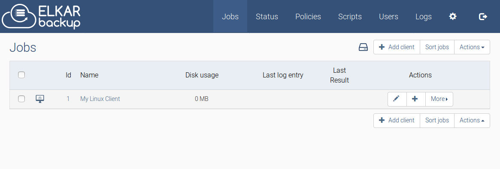
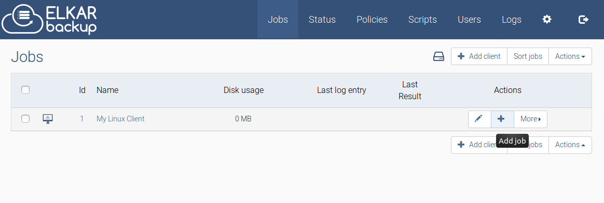
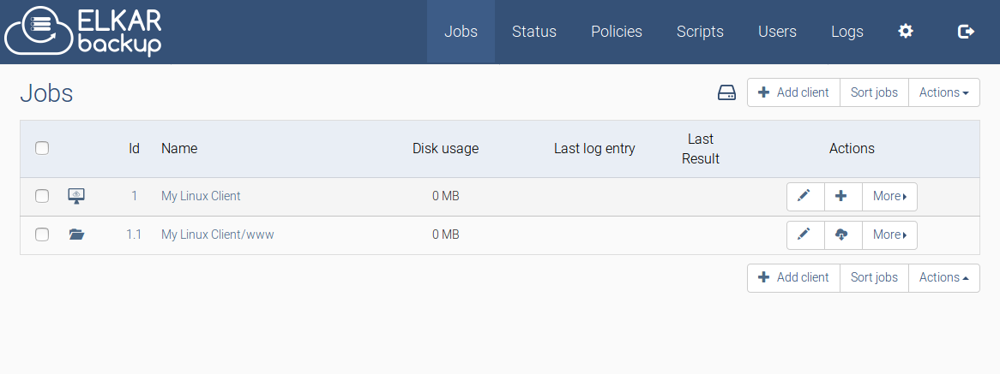
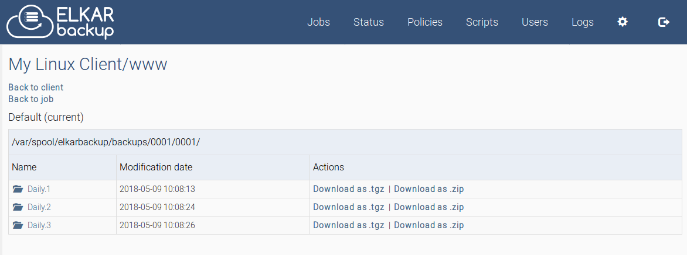

In our example, we want to backup the _**/var/www**_ folder from a GNU/Linux client that has the 192.168.1.2 IP address.

## Add the client

In order to add a new client, we have to click on the _**Add Client**_ button, and we will face a self-documented form where we will enter the client data.

In our example,

* Name: _My Linux Client_

* URL: root@192.168.1.2

Once we have enter this data, we will click on the _**Save**_ button and we will see the new client in the main page.  


As this has to be an automated proccess, our server needs to use the correct credentials to connect to *"My Linux Client"*, but we haven't given this information in the client configuration. As long as we are using the SSH protocol, we will use the public/private key pair.

We can download the Elkarbackup server public key from the _**Configuration menu --&gt; Manage parameters**_.


<details>
<summary>An alternative way to download the public key</summary>
  You can also dowload the public key directly into your client using the CLI with `curl` or `wget`:
  ```sh
  curl -k https://<elkarbackup-server-address>/config/publickey/get
  ```
</details>

Now, we have to configure this public key in the GNU/Linux client. Once it is done, we will be able to automatice the ssh connections needed for the backup proccess. In this backup connections, we have two roles:

* ElkarBackup _**Server**_: It has the _**client**_ role in the connection.
* GNU/Linux _**Client**_: It has the _**server**_ role in the ssh connection, so it is neccesary to install there the openssh-server package if it is not previosly installed.

Now we will issue this command in order to copy the newly downloaded public key in the client.

> ssh-copy-id -i Publickey.pub root@192.168.1.2

Take into account that we are using the _**root**_ user in the client machine. As you could imagine, you need to know the root's password in the client machine.

If you don't have a linux machine to issue this command, you can do it from a console in the Elkarbackup server. In this case, you can issue the command using the path where the public key is stored:

> root@elkarbackup:~\# ssh-copy-id -i /var/lib/elkarbackup/.ssh/id\_rsa.pub root@192.168.1.2

Another package that we need in the GNU/Linux client is _**rsync**_, so if it isn't installed, we can install it with this command:

> root@LinuxClient:~\# apt-get install rsync

## Add the job

The next step is to create the job. As we have said before, we want to backup the _**/var/www**_ folder, so we click in the _**Add job**_ button **\(+\)**



We will receive a self-documented form where it is explained which data we have to fill. In our example, we will change only this fields:

* **Name**: www
* **Path**: /var/www
* **Description**: Apache Web Server Folders
* **Policy**: Default policy

Just click on _**Save**_ and the task will be listed in the main page as shown in the following screenshot



As you noticed, the _**Last log entry**_ and _**Last Result**_ columns don't show anything yet. Sooner than later, you will noticed that in these columns we will see the last execution timestamp and it's state.

But when? It depends on its _**Policy**_ configuration. We have assigned the _**Default Policy**_ to this job, so if we see how it is configurated we could see which are it's _**schedule**_ and _**retention policy**_.

To better understand the concept of policies, it is convenient to have a clear understanding of the concepts explained in the section _**"A review of concepts: Rsnapshot"**_, since it is the logic used in our application. In the end we will go deeper into this part.

If we let the time \(in this example some days\) to make the first copies and then we click on the _**Restore**_    button we will see the result



As we can see the folder **Daily.0 **contains the data of the last copy, but we have also more folders containing backups made in previous days. If we go into any of them we can get to the concrete file that we are interested in recovering. We can download a single file or a compressed folder with many files inside.

In the _**Advanced options**_ section you can customize also some parameters related to the ssh and rsync connections, as the ssh connection port, bandwith used in the connection, etc.

