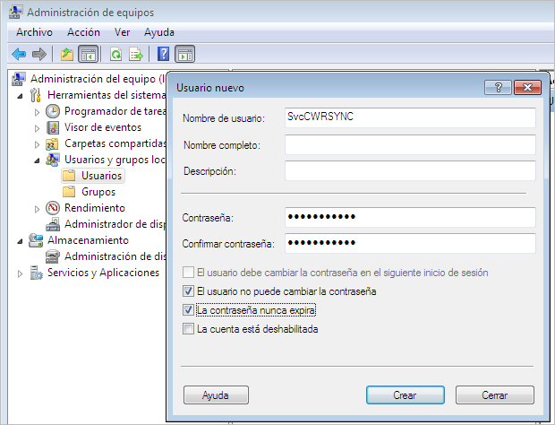
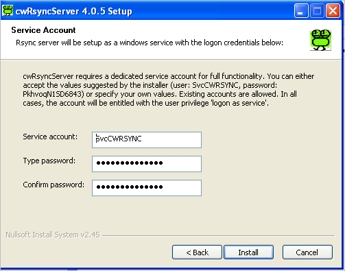
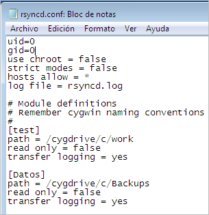
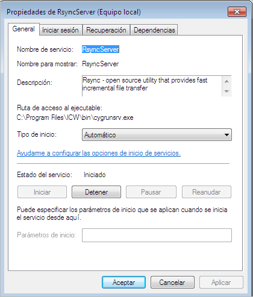
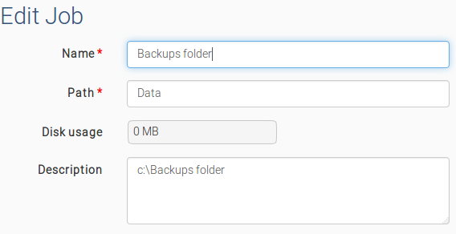

> _**Note**_: Nowadays we are trying to find a better way in order to make easier the process to backup data from Windows clients. It appears that in the near future Windows versions will have the option to run ssh as service, so we could configure Windows and Linux clients using the same procedure. In the meantime we will continue to use the procedure described below.

The main difference between Windows and Linux clients is in the URL parameter, the rest is the same.

With Windows servers use the _rsync_ protocol in place of ssh protocol. In order to do this, the Windows machine has to accept rsync connections, that is, it needs an active rsync server.

In our example:

```
Name: Cliente Windows

URL: 10.15.181.156:

QUOTA: -1

Description: One of our Windows Servers

Pre/Post script: We leave it unselected.
```

Pay attention to the URL parameter. After putting the IP address we have to put "_**:**_", this way we say that it uses the rsync protocol.

We can find different Rsync servers for Windows platforms. We will use the free version of [cwRsync](https://www.backupassist.com/rsync/cwRsyncServer_4.1.0_Installer.zip), for which we will download the cwRsyncServer 4.0.5 Installer.

Before we install, we will add a local user to the Windows machine. In the virtual machine with Windows7 that we are using in the example we have called the user _**SvcCWRSYNC**_ and we have given _**elkarbackup**_ as the user's password.



As the service is going to run with this user, it is desirable that they have the necessary permissions, so in the example I have added it to the administrators group \(probably with fewer permissions will also be enough\)


We now proceed to the installation of the cwRsyncServer program. The installation will ask for the user and the password for this service, and we will introduce the ones we just created



Once the installation is finished, it will appear among the available programs, and we will edit the file _**rsyncd.conf**_ to specify which are the folders we want to synchronize. In Windows 7 and higher it is necessary to open it as administrator, otherwise it does not allow to save the changes. We will do this by clicking the right button and "running" it as administrator.


This would be the configuration to configure the C:\Backups folder

At the beginning we put these two lines:

> uid=0
>
> gid=0

Next we add a block for each folder we want to synchronize. In the example we have named the folder as_** \[Data\]:**_

> \[Data\]
>
> path = /cygdrive/c/Backups
>
> read only = false
>
> transfer logging = yes

If the folder you want to copy instead of being in _**c:\Backups**_ is in _**d:\Backups**_, the path line would be this:

> path = /cygdrive/d/Backups



Now we check that the service is running, and if it was not, we would boot it specifying that the boot has to be automatic




Now we go back to the ElkarBackup interface and add a task to our Windows client to make a copy of your _**Backups folder**_.

We have to keep in mind that this folder in the configuration file of the Windows machine has been configured in the_** \[Data\]**_ block, and that will be the name that we will use in the _**Path**_ field. We also apply the policy _**Default policy**_.



We will save it and click the _**Run Now**_ button to verify that the copy is done without errors. This option allows us to launch the task without waiting for scheduled execution to arrive. The screen that gives us the overview will also give us information about the status of each task, showing those that are waiting \(_**QUEUED**_\) or running \(_**RUNNING**_\).

If we wait, we will see that the copy has been made. In the _**Log**_ also we can see information of the process result.

