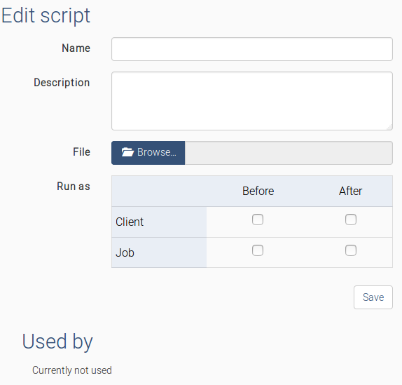

These are the data that Elkarbackup asks for when creating a new script:

* Name and Description
* File: To load the script that we have previously programmed in our computer
* Execution options: Depending on the logic of each script, some will be designed to be executed at _**client level**_, while others may be thought to run at _**job level**_. Of these, some to be executed as _**Pre-script**_ \(to be performed before the action is executed\) and others to be executed as _**Post-script**_ \(to be performed after the action is executed\). We will decide how they can be executed, and depending on that decision we will have the option to choose them in the clients and/or tasks.
* Environment Variables: Since scripts can be used in more than one client and task, when we are writing them we do not know which client or folder are related to this execution, and in most cases this information will be necessary. In our scritps we can use the following environment variables:
  * ELKARBACKUP\_LEVEL: Its value can be JOB or CLIENT  
  * ELKARBACKUP\_EVENT: Its value can be PRE or POST
  * ELKARBACKUP\_URL: Its value will be the complete URL of the task or client
  * ELKARBACKUP\_ID: Task ID or client ID \(number\)
  * ELKARBACKUP\_PATH: Full path of the root folder
  * ELKARBACKUP\_STATUS: Post-scripts output status, always 0.

If we view or edit the information of a script previously created, we can see where it is being used, and we will also have the option to download it to our computer. The scripts are saved in the Elkarbackup server in _**/var/spool /elkarbackup/uploads**_ folder.

You can find an example of Script in the section _**"Script to compress the repository"**_.

